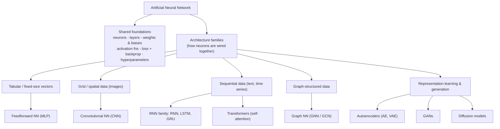

# Artificial Neural Networks — Cheat Sheet

A concept map of what an ANN *is* (the building blocks every network shares) and a tour of the
major **architecture families** built from those blocks — organized by the kind of data/problem
each one is built for. Companion implementation, visualizations, and deeper walkthroughs live in
[`ANNs_Explained.ipynb`](ANNs_Explained.ipynb).

## 1. What is an ANN?

An **Artificial Neural Network** is a model loosely inspired by the structure and function of the
brain: many simple computational units (**neurons**), connected together, that jointly learn to
approximate a function mapping inputs to outputs. Every architecture below — however different it
looks — is built from the same small set of foundations in §2, just wired together differently.



## 2. Universal building blocks

These apply to *every* architecture in §3 — a CNN, a Transformer, and a plain MLP are all trained
the same way, on the same core primitives.

### 2.1 Anatomy of a network

| Concept | Description |
|---|---|
| **Neuron / node** | Smallest unit. Internally it's just a linear regression: weighted sum of inputs + bias, passed through an activation function. |
| **Layer** | A group of neurons operating in parallel. **Input layer** (raw features) → **hidden layer(s)** (learned representations) → **output layer** (prediction). |
| **Dense / fully-connected layer** | Every neuron in the layer is connected to every neuron in the previous layer. The default layer type in an MLP; also shows up as the final layers of most other architectures. |
| **Weight (`w`)** | Strength of a connection (synapse) between two neurons. Learned during training. |
| **Bias (`b`)** | Per-neuron offset/threshold. Shifts the activation function so it doesn't have to pass through the origin — controls when a neuron "activates." |
| **Connection / edge** | Carries a signal (a real number) from one neuron to another, scaled by its weight. |

**Per-neuron computation:**

```
z = (x1*w1 + x2*w2 + ... + xn*wn) + b     # weighted sum + bias
a = activation(z)                          # non-linearity
```

The output of a neuron (`a`) is passed forward as an input to the next layer.

**Shallow vs. deep:** a **single-layer / shallow** network has 1 hidden layer; a **deep neural
network (DNN)** has more than 1. Depth lets the network build a hierarchy of representations —
each layer learns a higher-level, more abstract feature on top of the previous layer's output,
breaking a hard problem into smaller sub-problems.

### 2.2 Activation functions

An activation function decides whether/how strongly a neuron "fires," and — critically —
introduces **non-linearity**, without which stacking layers would collapse into a single linear
model no matter how deep the network is.

| Function | Formula | Range | Notes |
|---|---|---|---|
| **Sigmoid** (logistic) | σ(x) = 1 / (1 + e⁻ˣ) | (0, 1) | Smooth, interpretable as a probability. Prone to **vanishing gradients** in deep nets. Used for binary-output layers. |
| **Tanh** | tanh(x) = (e²ˣ − 1) / (e²ˣ + 1) | (−1, 1) | Zero-centered (helps optimization vs. sigmoid). Still saturates, less severely. Common inside RNN cells. |
| **ReLU** | f(x) = max(0, x) | [0, +∞) | Simple, cheap, doesn't saturate for x > 0. Can "die" for x < 0. Default choice for hidden layers in MLPs/CNNs. |
| **Softmax** | softmaxᵢ(x) = eˣⁱ / Σⱼ eˣʲ | (0, 1), sums to 1 | Turns a vector of scores into a probability distribution. Standard for multi-class output layers, and for attention weights in Transformers. |
| **GELU / SiLU (Swish)** | smooth, ReLU-like approximations | ≈ (−0.2, +∞) | Smoother than ReLU; the default in most modern Transformers (BERT, GPT-style models). |

### 2.3 Training a network

| Concept | Description |
|---|---|
| **Loss function** | Measures the error between prediction and ground truth. What training minimizes. |
| **Backpropagation** | Algorithm that computes how much each weight contributed to the error (via the chain rule) so it can be adjusted. |
| **Optimizer** | Update rule that uses those gradients to adjust weights/biases (e.g. SGD, Adam). |

**Key hyperparameters:** learning rate (step size per update), number of hidden layers (depth),
number of neurons per layer (width), and batch size (examples per weight update).

**Batch vs. online learning**

| | Description |
|---|---|
| **Batch learning** | Model trains on historical data in (large) batches, all at once — one weight update per batch. |
| **Online learning** | Model updates incrementally as new data arrives, one (or few) example(s) at a time — many more, noisier updates. |

### 2.4 Bias–variance trade-off

| | Cause | Symptom |
|---|---|---|
| **Bias** | Model too simple to capture the pattern | **Underfitting** — poor fit even on training data, insensitive to new data because the error is systematic |
| **Variance** | Model too complex, learns noise as if it were signal | **Overfitting** — great fit on training data, poor generalization, highly sensitive to new data |

**Mitigation strategies:** regularization, cross-validation, ensemble methods, feature selection,
early stopping, dropout.

## 3. Architecture families

Organized by the kind of data each was designed for — this is the part that actually changes
between architectures; everything above stays the same.

### 3.1 Feedforward Neural Network (FNN / MLP) — tabular / fixed-size vectors

Information flows strictly forward: input → hidden layer(s) → output, no cycles, no shared
weights across inputs. The baseline architecture — every other family below still uses dense
(feedforward) layers internally, they just add structure *around* them.

- **Use for:** fixed-length feature vectors (tabular data), or as the final "head" on top of a
  CNN/RNN/Transformer's learned representation.
- **Watch out for:** doesn't exploit spatial or sequential structure — flattening an image into a
  vector throws away the fact that nearby pixels are related.

### 3.2 Convolutional Neural Network (CNN) — grid / spatial data (images)

Instead of connecting every input to every neuron, a CNN slides a small learned **filter
(kernel)** across the input, computing a weighted sum in each local neighborhood. This gives two
properties an MLP doesn't have:

| Concept | Description |
|---|---|
| **Convolution / filter (kernel)** | A small weight matrix (e.g. 3×3) slid across the input, producing one **feature map** per filter. Learns to detect a local pattern (an edge, a texture, ...). |
| **Parameter sharing** | The same filter is reused at every spatial location → far fewer parameters than a dense layer over the same input, and the pattern is detected wherever it appears (**translation invariance**). |
| **Pooling** | Downsamples feature maps (e.g. max-pooling) to reduce resolution and add a bit of positional tolerance. |
| **Stacking** | Early layers learn low-level features (edges), deeper layers combine them into higher-level ones (shapes, parts, objects) — same hierarchical idea as MLP depth, specialized for grids. |

- **Use for:** images, and more generally any grid-like data with local structure (spectrograms,
  some spatial sensor data).

### 3.3 Recurrent Neural Network family — sequential data

Unlike a feedforward net, information can loop back — the network keeps a **hidden state**
(memory) that is updated at every step, making it suited to **sequences / time series**. Plain
("vanilla") RNNs struggle with long sequences because gradients shrink (or blow up) as they're
backpropagated through many time steps — which motivated two gated variants:

| Variant | Gates | Idea |
|---|---|---|
| **Vanilla RNN** | — | Hidden state = f(previous hidden state, current input). Simple, but forgets long-range information. |
| **LSTM** (Long Short-Term Memory) | Input, Forget, Output | Maintains a separate **cell state** that carries long-term information across many steps largely untouched, addressing the vanishing-gradient problem. |
| **GRU** (Gated Recurrent Unit) | Reset, Update | Merges cell state and hidden state into one. Fewer parameters than LSTM → computationally simpler, often comparably effective. |

- **Use for:** time series, audio, text (historically) — largely superseded by Transformers for
  long text, but still common for streaming/online or resource-constrained sequence tasks.

### 3.4 Transformers — sequential data, parallel & long-range

Built around **self-attention**: for every element of a sequence, the model learns how much
"attention" to pay to every other element, rather than processing it strictly step-by-step like an
RNN. This allows full parallelism (no waiting on the previous step) and direct modeling of
long-range dependencies.

| Concept | Description |
|---|---|
| **Query / Key / Value** | Each position projects itself into a Query, Key, and Value vector. Attention weight between positions *i* and *j* = softmax of (Query_i · Key_j). Output at *i* = weighted sum of all Values, using those weights. |
| **Multi-head attention** | Several attention computations ("heads") run in parallel with different learned projections, letting different heads specialize in different kinds of relationships. |
| **Positional encoding** | Attention itself is order-agnostic, so position information is injected separately (added to the input embeddings) when order matters. |
| **Encoder / Decoder** | Encoder-only (e.g. BERT-style): builds representations for understanding tasks. Decoder-only (e.g. GPT-style): generates text autoregressively. Encoder–decoder (e.g. T5-style): sequence-to-sequence, with the decoder also cross-attending to the encoder's output. |

- **Use for:** current state of the art for text (LLMs), and increasingly for images, audio, and
  multimodal models (a patch of an image, a frame of audio, etc. just becomes another "token").

### 3.5 Autoencoders — representation learning

An unsupervised network trained to reconstruct its own input, squeezed through a
lower-dimensional **bottleneck** (encoder → latent code → decoder). Forced through that
bottleneck, it has to learn a compressed representation.

| Variant | Idea |
|---|---|
| **Vanilla autoencoder (AE)** | Deterministic bottleneck; good for compression, denoising, anomaly detection (poor reconstruction ⇒ anomalous input). |
| **Denoising autoencoder** | Trained to reconstruct a *clean* input from a *corrupted* one — forces the latent code to capture signal, not noise. |
| **Variational autoencoder (VAE)** | Encoder outputs a *distribution* (mean/variance) over the latent space instead of a single point, and the model is trained to keep that distribution close to a simple prior (e.g. Gaussian). Because the latent space is now smooth and well-behaved, you can **sample** a random point and decode it into a new, plausible output — a generative model, not just a compressor. |

### 3.6 Generative Adversarial Networks (GAN) — generative modeling

Two networks trained against each other in a minimax game:

| Component | Role |
|---|---|
| **Generator** | Takes random noise, tries to produce fake samples realistic enough to fool the discriminator. |
| **Discriminator** | Tries to tell real (training data) samples apart from the generator's fakes. |

Both improve together: a better discriminator pushes the generator to produce more realistic
samples, and a better generator forces the discriminator to get pickier. No explicit
reconstruction loss like an autoencoder — the "quality signal" comes entirely from the
adversarial game. **Watch out for:** training instability and *mode collapse* (generator finds a
few outputs that fool the discriminator and stops exploring).

### 3.7 Graph Neural Networks (GNN) — graph-structured data

Generalizes convolution from a fixed grid (CNN) to an arbitrary graph. Each node updates its
representation by **aggregating (message-passing) information from its neighbors**, layer by
layer — after *k* layers, a node's representation has been influenced by everything within *k*
hops of it in the graph.

- **Use for:** social networks, molecules, recommendation graphs, knowledge graphs — any data
  where the *relationships* between items are as important as the items themselves.
- **Common tasks:** node classification (label a node from its neighborhood), link prediction
  (will an edge exist?), graph classification (label the whole graph).

### 3.8 Other notable families (for completeness)

Not covered in depth here, but worth knowing exist:

| Type | Idea |
|---|---|
| **Diffusion models** | Learn to reverse a gradual noising process; iteratively denoise pure noise into a sample. Current SOTA for image/audio/video generation, increasingly used alongside/instead of GANs. |
| **Hopfield networks / RBMs** | Classic *energy-based* models — associative memory, historically important precursors to modern deep generative models. |
| **Self-organizing maps (SOM)** | Unsupervised, produces a low-dimensional, topologically-ordered map of the input space — an older alternative to autoencoders/embeddings for visualization. |
| **Radial basis function (RBF) networks** | Hidden units activate based on distance to a learned center rather than a dot product — classic universal approximator, largely superseded by MLPs. |
| **Spiking neural networks (SNN)** | Neurons communicate via discrete spikes over time rather than continuous activations — closer to biological neurons, aimed at neuromorphic/low-power hardware. |

## 4. Embeddings — a technique, not a standalone architecture

An **embedding** maps discrete, categorical variables (words, categories, IDs, graph nodes) into a
continuous, typically lower-dimensional vector space — because neural networks operate on
continuous data, not raw categories. It shows up *inside* most of the architectures above (word
embeddings feeding a Transformer, node embeddings inside a GNN, category embeddings feeding an
MLP, ...) rather than as its own network type.

- **Encoding**: category → continuous vector.
- **Decoding**: continuous vector → category.

Similar categories end up near each other in the embedding space, learned jointly with whatever
task the network is trained on (or pretrained separately and reused).

## 5. Quick reference: which architecture for which data?

| Data type | Architecture |
|---|---|
| Fixed-size feature vectors (tabular) | Feedforward NN / MLP |
| Images / grid-like spatial data | CNN |
| Sequences / time series | RNN, LSTM, GRU, or Transformer |
| Long sequences, need for parallelism (text, etc.) | Transformer |
| Graph-structured data | Graph Neural Network |
| Compression, denoising, anomaly detection | Autoencoder |
| Generating new, realistic samples | VAE, GAN, or diffusion model |
| Categorical inputs feeding any of the above | Embedding layer as the first layer |
